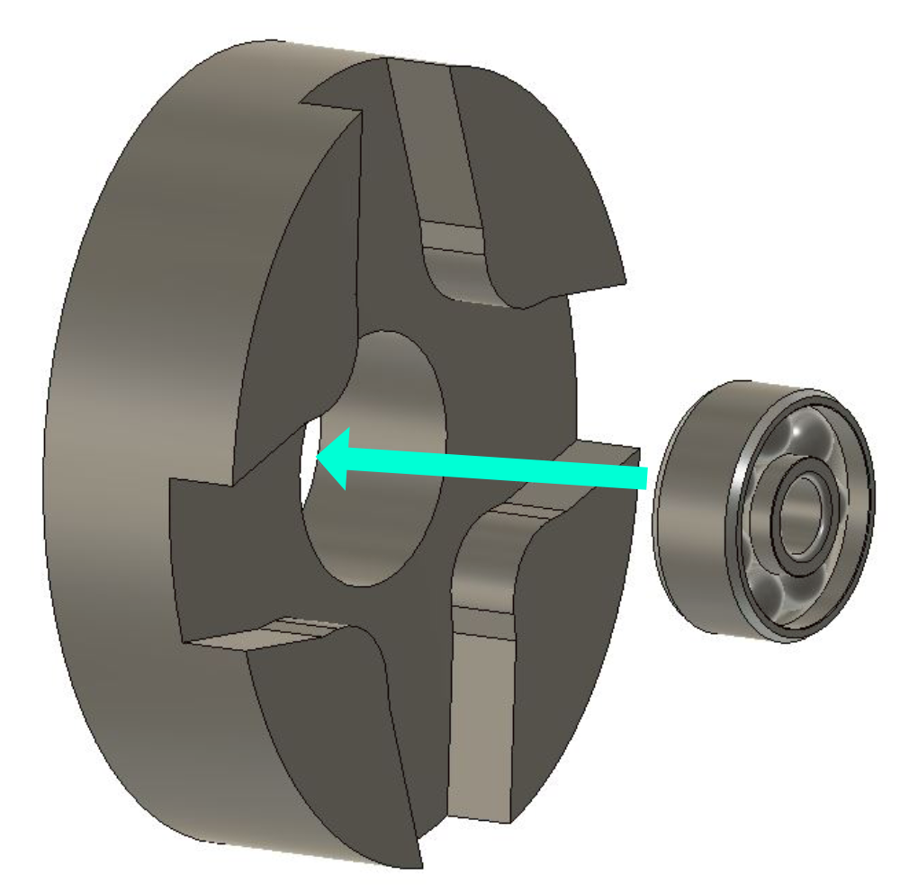
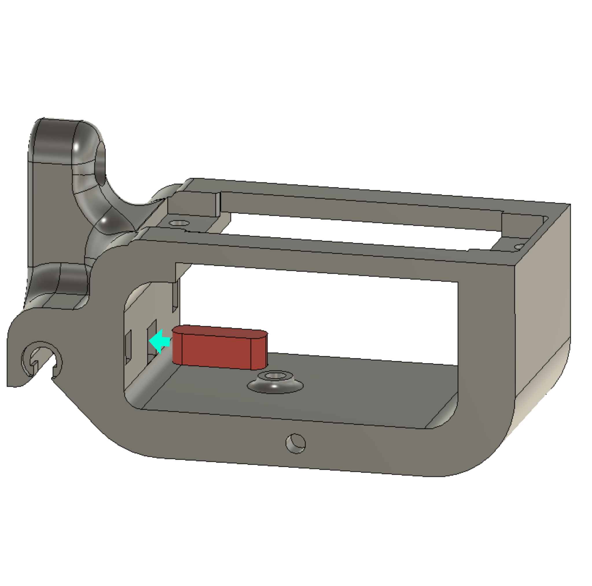
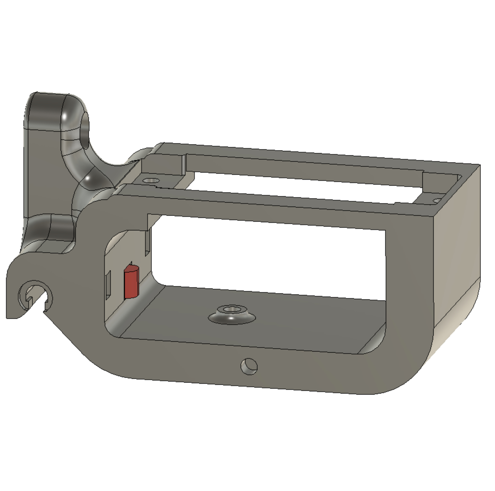
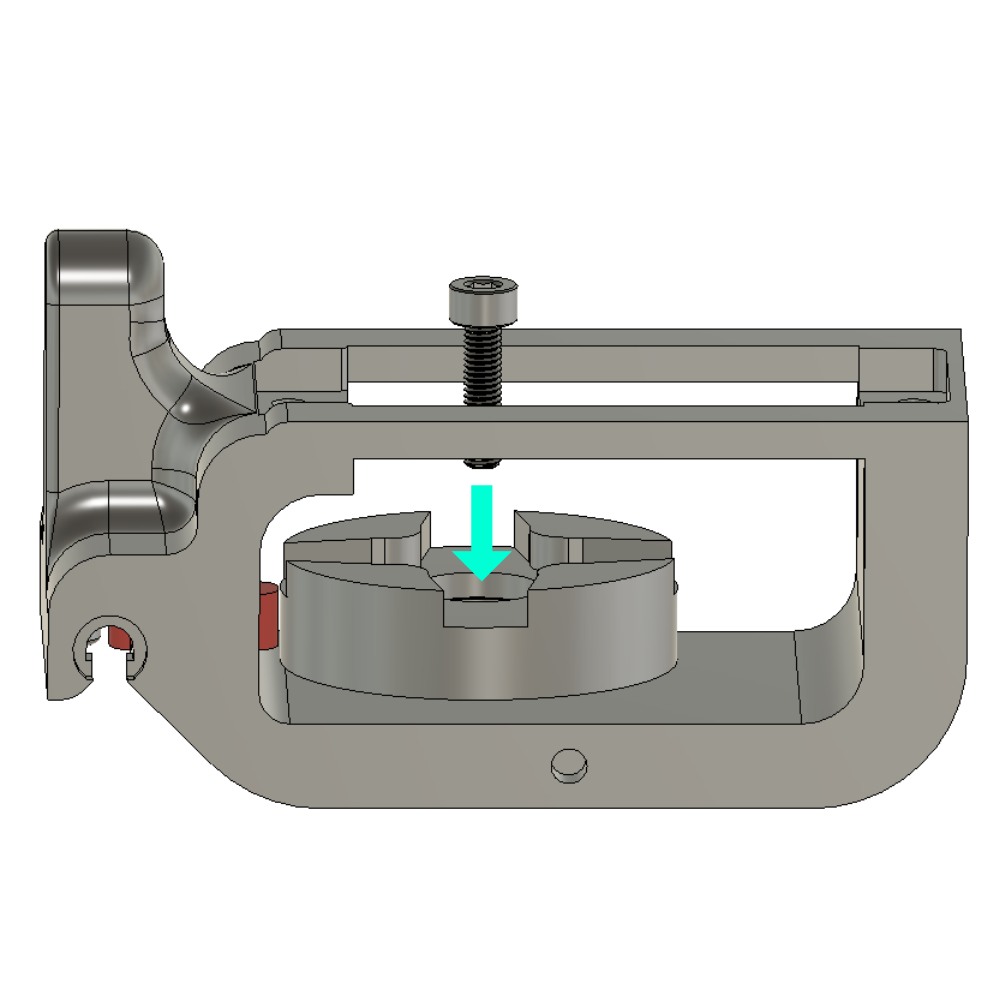
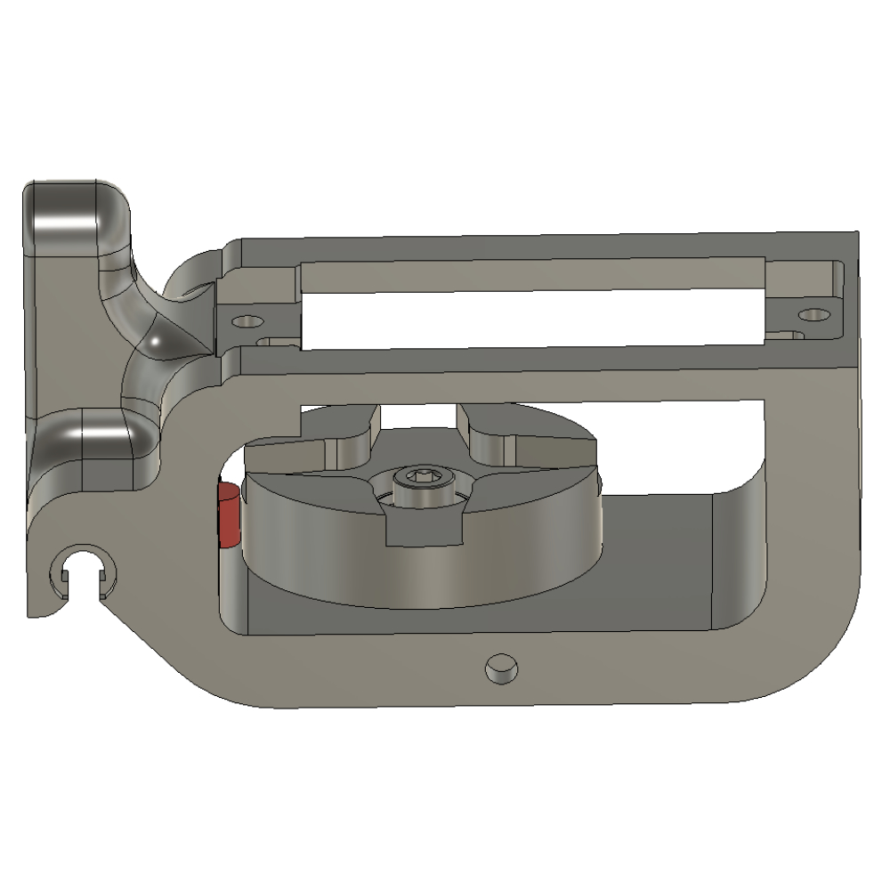
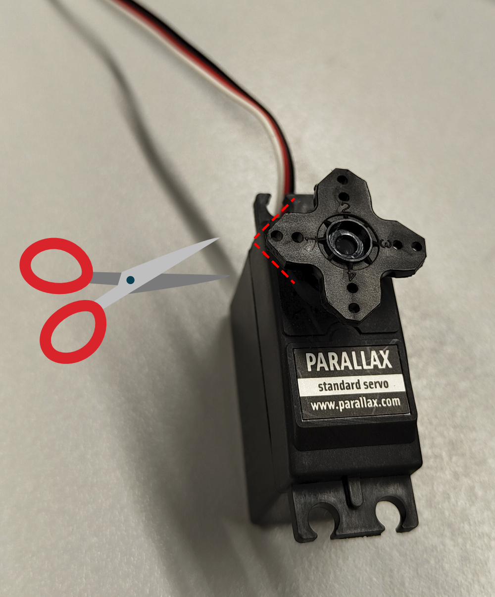
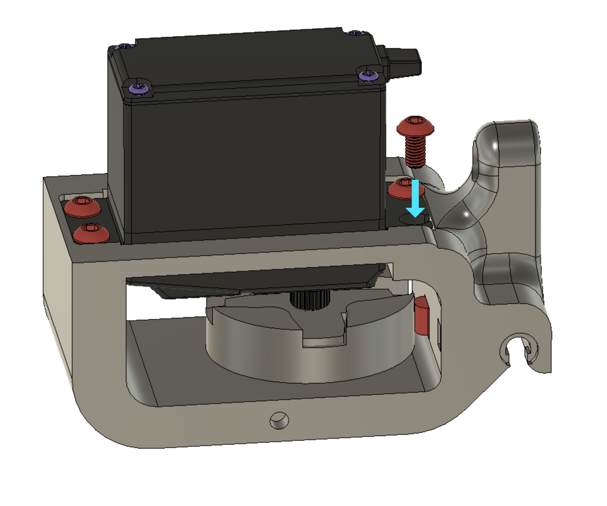

{{BOM}}

# 2-  Parts Assembly

## Cam & Bearing {pagestep}

* Insert the [bearing](Parts.yaml#Bearing){Qty: 1} into the rotary [cam.stl](3d_models/cam.stl){previewpage} 

<!-- You can drag and drop your images directly here and use this template -->

## Clamp {pagestep}

* Place the  [clamp.stl](3d_models/clamp.stl){previewpage} into the [main part.stl](3d_models/main_part.stl){previewpage}

## Secure Rotary Cam{pagestep}

* Insert the screws [M3x12 CHC](Parts.yaml#M3x12CHC){Qty: 1} socket head cap screw to secure the rotary cam onto the main component with an [allen key]{Qty: 1, Cat: tool} .

>i **Note** 
>i
>i You must screw directly into the plastic.

##Servo Motor{pagestep}
* Take the [servo motor](Parts.yaml#Servo){Qty: 1}  and reduce the size of the blades with a [wire cutter]{Qty: 1, Cat: tool} to ensure a proper fit with the rotary cam coupling.

## Secure servo motor{pagestep}
* Screw the servo motor onto the main part using [M3x6](Parts.yaml#M3x6){Qty: 4} screws x4 and  [allen key]{Qty: 1, Cat: tool} or  [screw driver]{Qty: 1, Cat: tool} depending on the type of screws used.
>i **Note** 
>i
>i You must screw directly into the plastic

* Remove the four screws from the servo motor casing.

>! **Caution** 
>!
>! Do not discard the four screws as we will reuse them in the next step.

