{{BOM}}

# 3- Electrical assembly

## Led {pagestep}

* Cut the servo motor wires with a [wire cutter]{Qty: 1, Cat: tool} and retrieve the cable gland for further steps, then insert the LED into its designated slot.
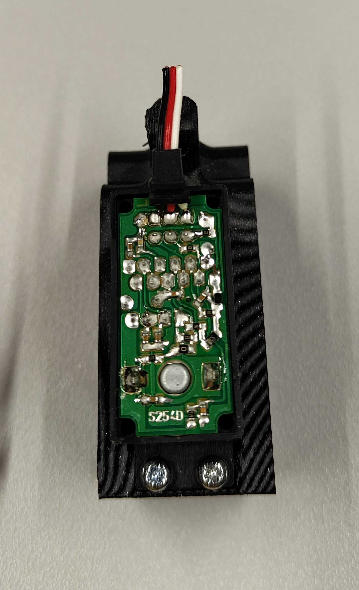
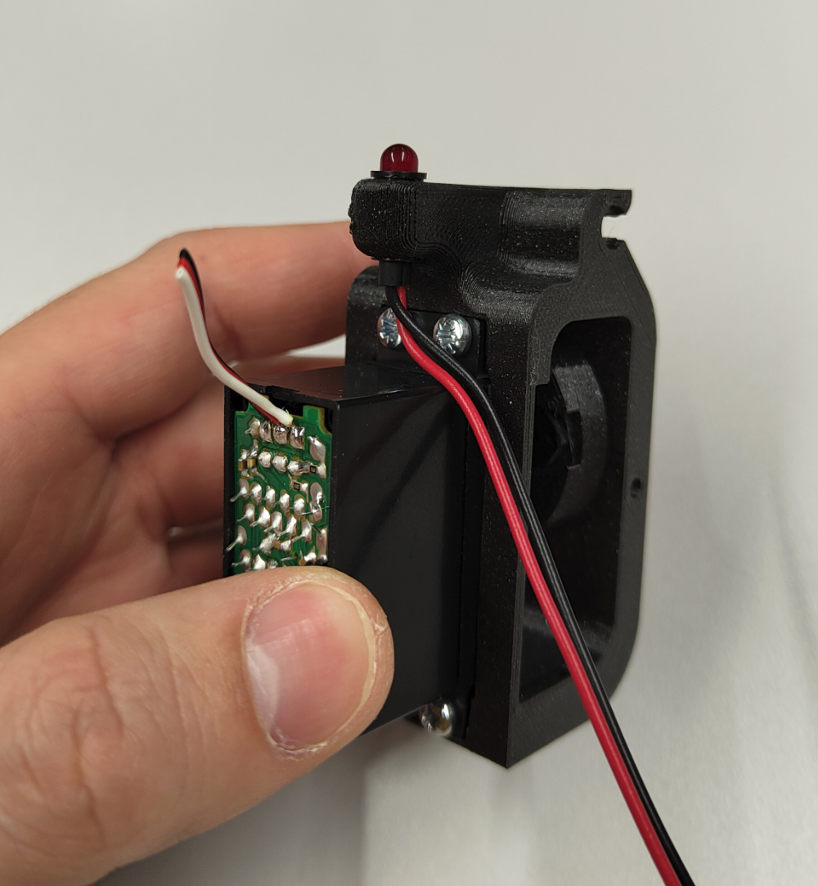
<!-- You can drag and drop your images directly here and use this template -->

## Preparation of the servo cap {pagestep}

* Insert the [cable](Parts.yaml#cable){Qty: 1} into the hole of the [servo cap.stl](3d_models/servo_cap.stl){previewpage}, and pull it sufficiently to strip it. Strip the cable 2.5 cm with a [stripping pliers]{Qty: 1, Cat: tool}. 

>! **Caution** 
>!
>!  Careful not to cut the strands inside

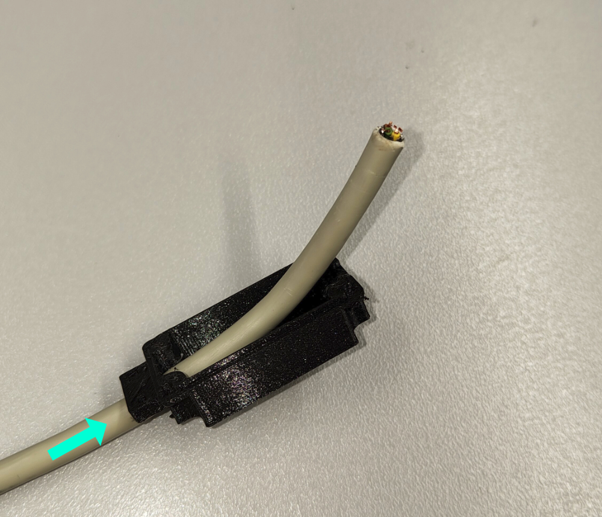

## Solder onto the PCB {pagestep}

* Cut the LED cables so they reach the bottom of the PCB compartment of the servo motor.
* Strip and solder the wires as shown in the photo with a [soldering iron]{Qty: 1, Cat: tool} to replace the original wires: Black to Grey, Red to Brown, and White to White.
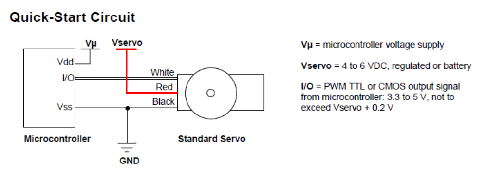
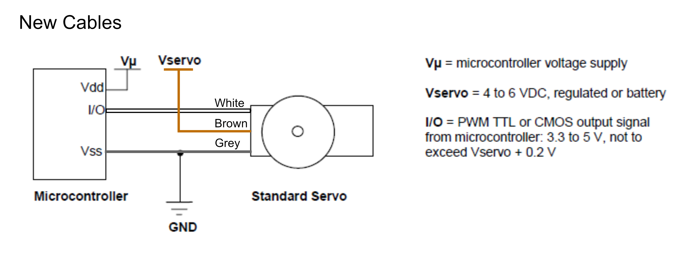
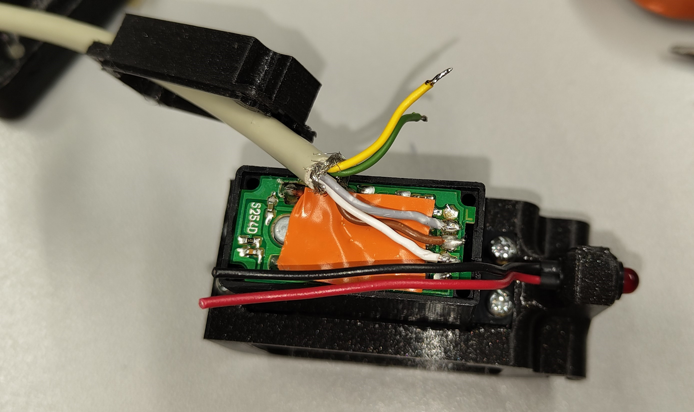

## Led wires {pagestep}

* Ensure that you have reattached the cable gland from the servo motor wires onto the LED cables. Solder the red LED cable to the yellow cable, then solder the black cable to the green one, securing the connections with [heat shrink](Parts.yaml#Heat_Shrink){Qty: 1} tubing.

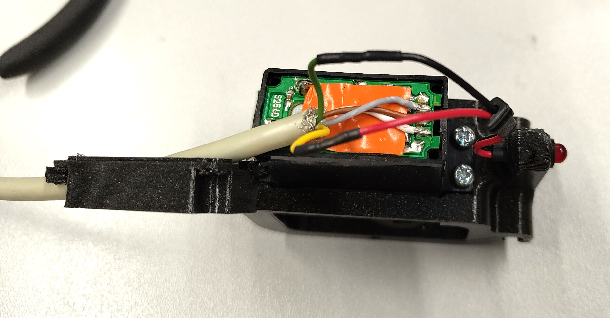

* Secure the servo cap onto the servo motor using the four screws previously retained.

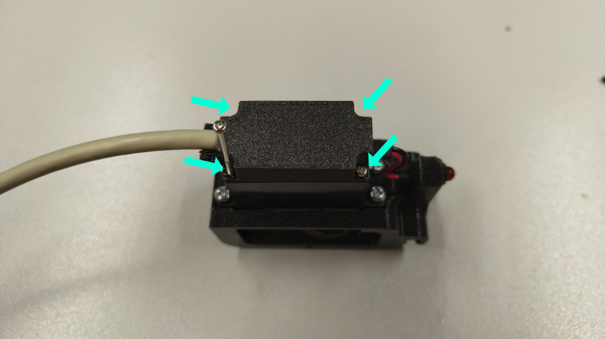

* Screw the [cable clamp.stl](3d_models/cable_clamp.stl){previewpage} in place using the two [M2x6](Parts.yaml#M2x6){Qty: 1} screws. 

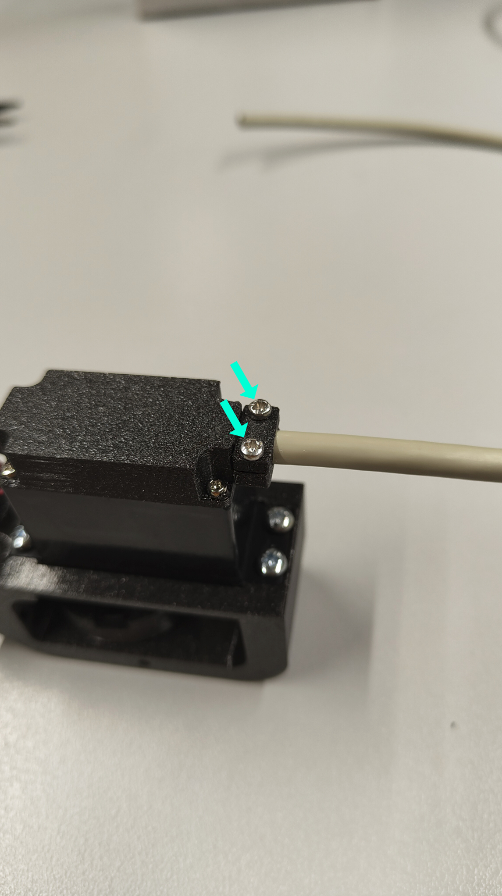

## Solder the connector{pagestep}

* Strip the end of the 5-strand cable to approximately 1cm.
* Solder the strands of the cable onto the pins of the [LEMO connector](Parts.yaml#Lemo){Qty: 1} following the diagram.

>!! **Warning** 
>!!
>!! Don't forget to insert all the parts of the lemo connector on the cable before soldering the wires. 

* Then tighten the connector's clamping screw to close it.

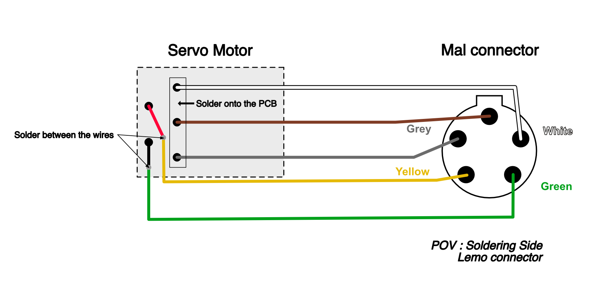
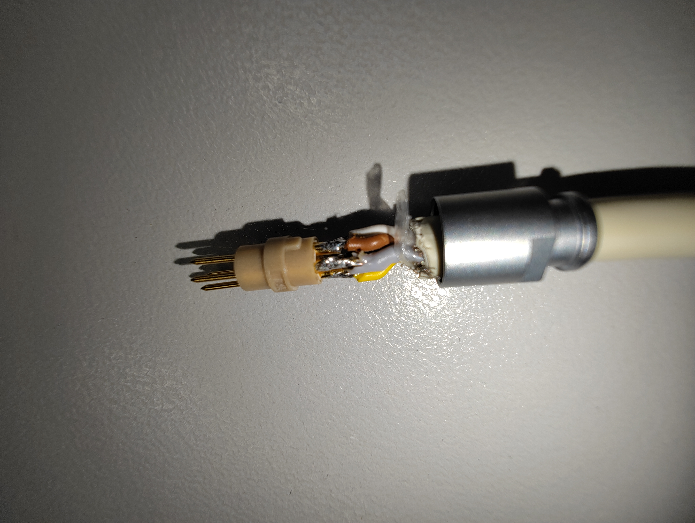

## Tadam !!{pagestep}

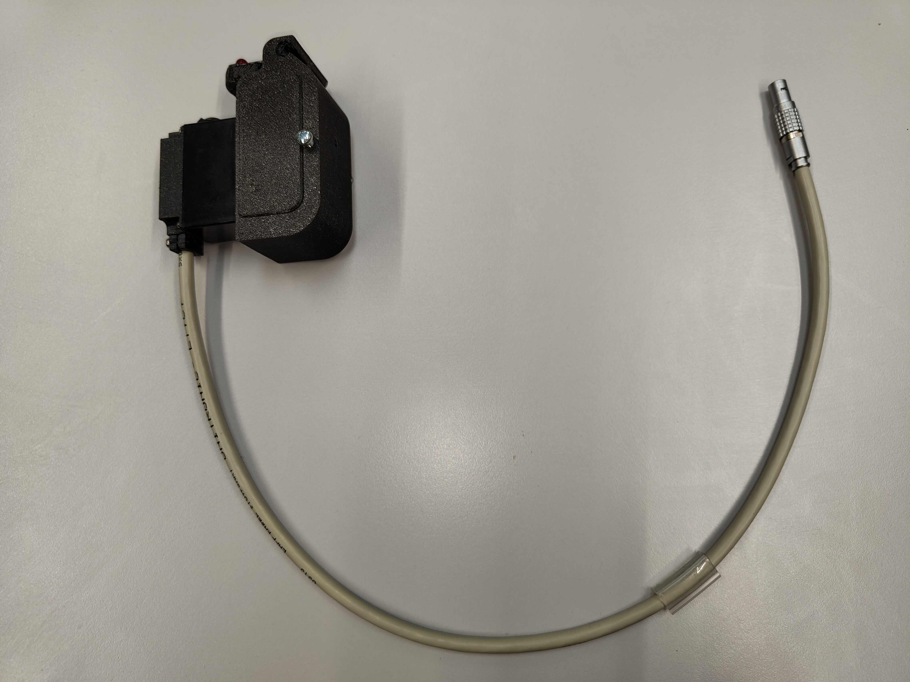

