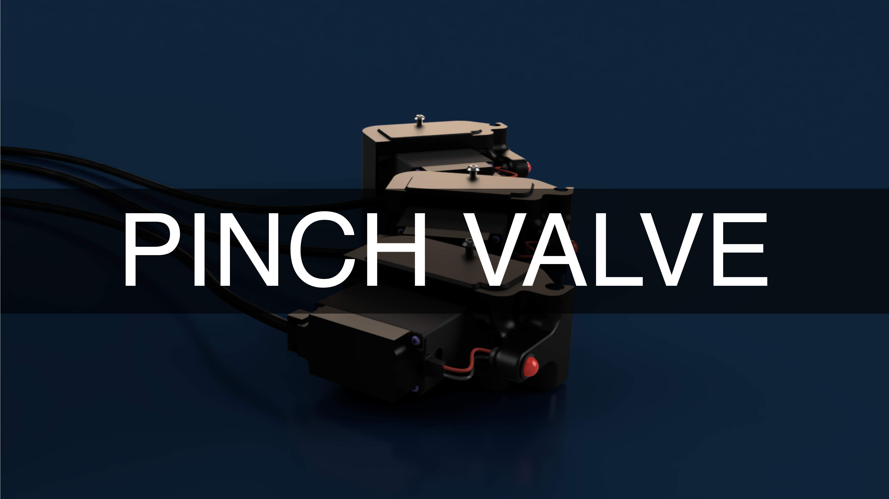
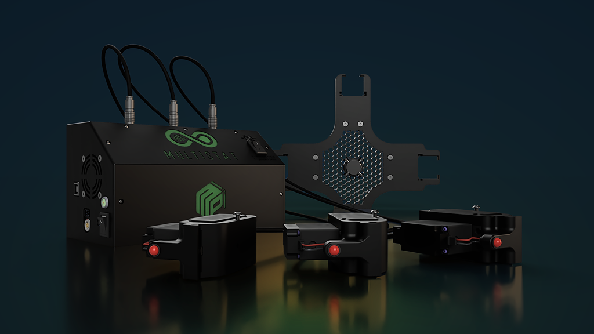

# Index

Documentation page here ---> https://douile17.github.io/pinch-valve-building/

**Introduction:**

Explore the future of fluid regulation with our Pinch Valve 3D, meticulously crafted to seamlessly integrate with the Multistat. This economical valve, entirely 3D-printed with cost-effective components, provides a high-performance solution tailored to your machine.
This pinch valve is compatible with the following pipes:  [Click here](Parts.yaml#Pipe){Qty: 1} 

**Key Features:**

- **Optimal Compatibility with the Multistat:** Our Pinch Valve 3D seamlessly adapts to the Multistat, ensuring flawless synergy between the valve and the machine.

- **Costs Controlled without Compromise:** Manufactured with budget-friendly components while maintaining reliable performance, this valve delivers quality fluid regulation at an affordable price.

- **Quick and Simple Installation:** The design streamlines the installation process on the Multistat, saving your time and simplifying integration.

- **Almost Nonexistent Wear:** After a year of continuous use without any issues, our Pinch Valve 3D demonstrates exceptional durability with virtually nonexistent wear.

**Choose Proven Reliability:**

Opt for the Pinch Valve 3D with the Multistat and benefit from an economical solution that provides consistent and reliable fluid regulation. Explore this documentation to understand how our technology can enhance the performance of your Multistat without compromising your budget. Get ready for worry-free regulation, where durability and efficiency converge to propel your business to new heights.

